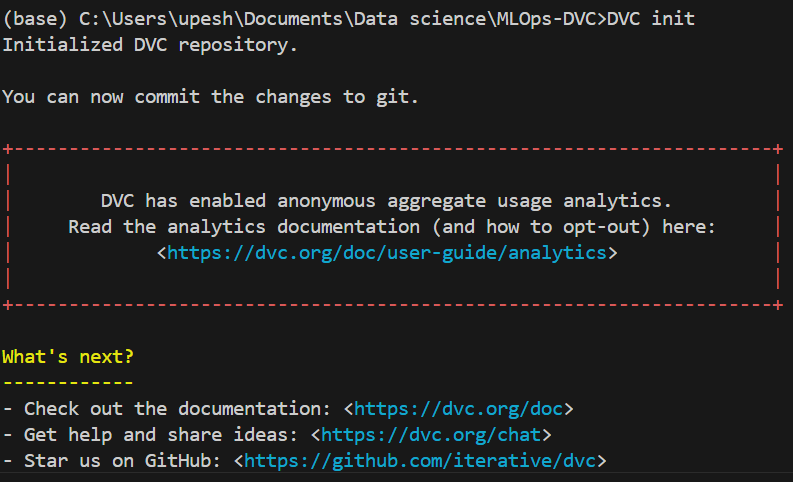
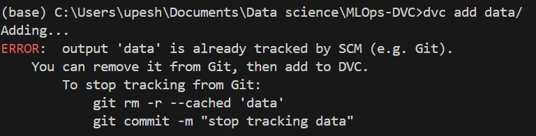
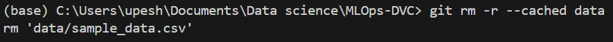

## Why not directly git?
1. Storage issue: Size of the file which can be tracked using git is limited.
2. DVC is better than Git for large datasets because Git tracks changes line by line, which becomes inefficient with millions of rows. DVC handles large data more efficiently without overloading the system.

## How git versions Data
**Analogy**: Suppose you visit a temple and some items are not allowed inside it. There are 2 counters first for keeping phone, wallet and bag and second counter is for keeping shoes. How to identify which item belongs to whom?
Person on first counter and that will also work on counter 2.

so first counter works as git and it will you a token which works for DVC(second counter) too.

In short There will be always a unique data version with each code version

## Code part
1. Create git repo and clone it in local.
2. Create mycode.py and add code to it. (it will save a csv file to a new "data" folder)
3. Do a git add-commit-push before initializing dvc.(`git add .`=> `git commit -m "msg"` => `git push origin main`)  
Install DVC `pip install dvc` if you don't have
4. Now we do "dvc init" (creates .dvcignore, .dvc)

5. Now do "mkdir S3" (creates a new S3 directory)
6. Now we do `dvc remote add -d myremote S3`
output: `Setting 'myremote' as a default remote.`
7. Next `dvc add data/` 

   Because initially we were tracking data/ folder from git so now we remove it for DVC to handle.
   
8. Again we do `dvc add data/` (creates data.dvc) then `git add .gitignore data.dvc`
9. Now - `dvc commit` and then `dvc push`
9. Do a git add-commit-push to mark this stage as first version of data.
10. Now make changes to mycode.py to append a new row in data, check changes via "dvc status"
11. Again - - `dvc commit` and then `dvc push`
12. Then git add-commit-push (we're saving V2 of our data at this point)
13. Check dvc/git status, everything should be upto date.
14. Now repeat step 10-12 for v3 of data.